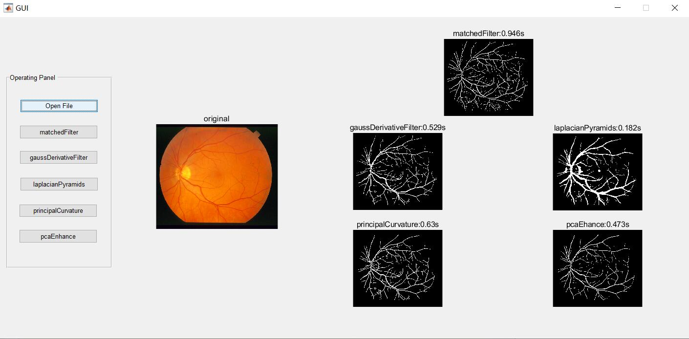

# Projects of digital image processing course
In 2020, I am studying digital image processing. These are some small projects that I did. 

( Matlab uses 2019a version, some functions are not compatible with the old version. At present, it is determined to use the version after 2016b as much as possible )

### 1. Sheet music segmentation

### 2. Retinal vessel segmentation

For the projects developed by the team, the contributors are not only me but also : 

[@Mateguo1](https://github.com/Mateguo1)

[@j15034106998](https://github.com/j15034106998)

